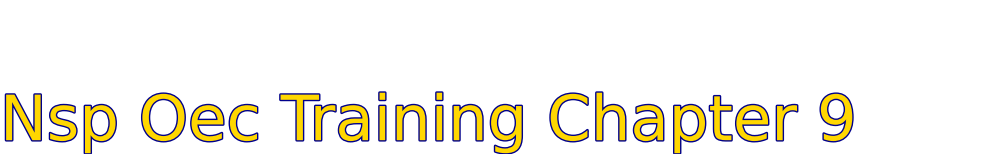

# Nsp Oec Training Chapter 9 - National Ski Patrol - Outdoor Emergency Care chapter 9
National Ski Patrol - Outdoor Emergency Care chapter 9

Chapter 9: Airway Management

1. Describe the function of the epiglottis.
2. Describe the mechanism of breathing.
3. Describe and demonstrate how to manually open the airway or mouth using techniques.
4. Describe and demonstrate the proper way to clear an airway using the methods of finger sweep, suctioning, gravity and positioning, and abdominal thrusts.
5. Explain and demonstrate the recovery position.
6. Describe the function of the oropharyngeal and nasopharyngeal airway, and demonstrate the sizing and placement of these devices.
7. Demonstrate the use of a face shield and pocket mask.
8. Explain the tips for safely using oxygen.
9. Explain the indications for and administration of oxygen.
10. Demonstrate how to place an oxygen cylinder into service.
11. Describe the various devices used for delivering oxygen to a patient.
12. Explain what a pulse oximeter is and how it is used.
13. Explain gastric distention and how to avoid it.

## 9.1 The function of the epiglottis
**epiglottis**: The epiglottis is a flap of cartilage located at the base of the tongue that plays a crucial role in preventing food and liquid from entering the airway during swallowing. Its primary function is to act as a switch between the trachea (windpipe) and the esophagus.
When you swallow, the epiglottis folds over the trachea, blocking the airway and directing food or liquid into the esophagus. This prevents choking and ensures that the airway remains clear for breathing.

## 9.2 The mechanism of breathing
The **mechanism of breathing** involves two main processes: inhalation (inspiration) and exhalation (expiration), driven by the action of the diaphragm and intercostal muscles.

1. **Inhalation**: The diaphragm contracts and moves downward, while the intercostal muscles between the ribs contract to expand the chest cavity.
This increases the volume of the thoracic (chest) cavity, creating negative pressure inside the lungs compared to the outside air.
As a result, air is drawn into the lungs through the airways to equalize the pressure.

2. **Exhalation**: The diaphragm relaxes and moves upward, while the intercostal muscles relax, causing the chest cavity to decrease in volume.
This increases the pressure inside the lungs, forcing air out through the airways.
Breathing is controlled by the respiratory centers in the brainstem, which respond to changes in carbon dioxide and oxygen levels in the blood. This process ensures a constant exchange of oxygen (for the body’s cells) and carbon dioxide (a waste product) with the external environment.

## 9.3 manually open the airway or mouth
Here are two common techniques used to manually open the airway or mouth in a patient:

1. **Head-Tilt, Chin-Lift Maneuver** (for non-trauma patients):
Purpose: Opens the airway by preventing the tongue from obstructing the throat.
Steps:
- Place one hand on the patient’s forehead and gently tilt the head back.
- Use the fingertips of your other hand to lift the chin upward.
- This motion helps to open the airway by extending the neck and moving the tongue away from the back of the throat.

Use: For unconscious or unresponsive patients without suspected spinal injuries.

2. **Jaw-Thrust Maneuver** (for trauma patients with possible spinal injury):
Purpose: Opens the airway without moving the head or neck, minimizing risk to the spine.
Steps:
Position yourself at the patient’s head, placing your hands on both sides of the jaw.
Using your index fingers, push the angles of the jaw upward, while stabilizing the head with your thumbs.
This action moves the jaw forward and opens the airway by moving the tongue away from the back of the throat.
Use: For trauma patients or when a spinal injury is suspected.
Both techniques are vital in maintaining an open airway to ensure adequate breathing, especially in emergencies.

## 9.4 manually open the airway or mouth
4. Describe and demonstrate the proper way to clear an airway using the methods of finger sweep, suctioning, gravity and positioning, and abdominal thrusts.
5. Explain and demonstrate the recovery position.
6. Describe the function of the oropharyngeal and nasopharyngeal airway, and demonstrate the sizing and placement of these devices.
7. Demonstrate the use of a face shield and pocket mask.
8. Explain the tips for safely using oxygen.
9. Explain the indications for and administration of oxygen.
10. Demonstrate how to place an oxygen cylinder into service.
11. Describe the various devices used for delivering oxygen to a patient.
12. Explain what a pulse oximeter is and how it is used.
13. Explain gastric distention and how to avoid it.

## Getting Started
To get started with the **Nsp Oec Training Chapter 9** solution repository, follow these steps:
1. Clone the repository to your local machine.
2. Install the required dependencies listed at the top of the notebook.
3. Explore the example code provided in the repository and experiment.
4. Run the notebook and make it your own - **EASY !**
    
## Solution Features
- Easy to understand and use  
- Easily Configurable 
- Quickly start your project with pre-built templates
- Its Fast and Automated

## Notebook Features
- **Self Documenting** - Automatically identifes major steps in notebook 
- **Self Testing** - Unit Testing for each function
- **Easily Configurable** - Easily modify with **config.INI** - keyname value pairs
- **Includes Talking Code** - The code explains itself 
- **Self Logging** - Enhanced python standard logging   
- **Self Debugging** - Enhanced python standard debugging
- **Low Code** - or - No Code  - Most solutions are under 50 lines of code
- **Educational** - Includes educational dialogue and background material
    
## Deliverables or Figures
 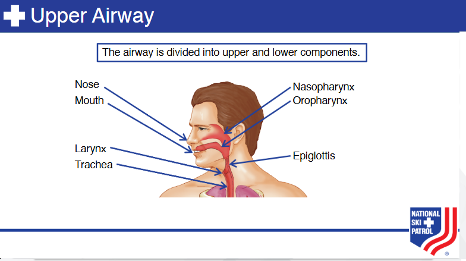   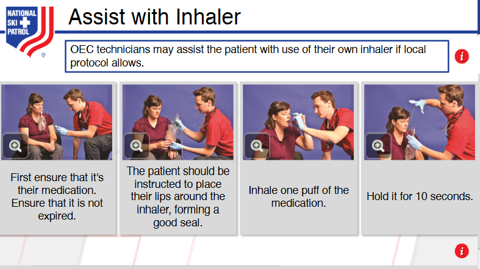   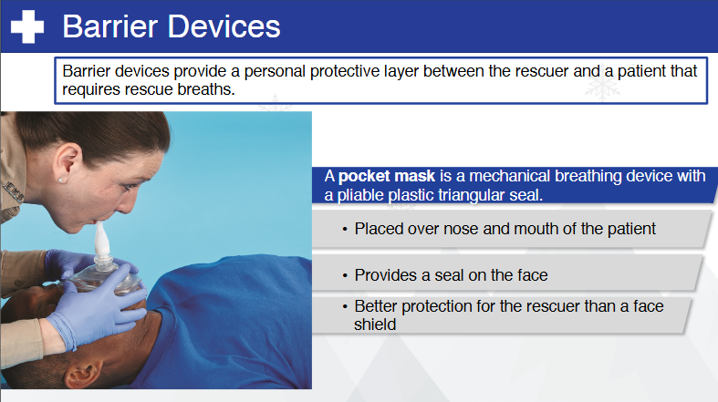   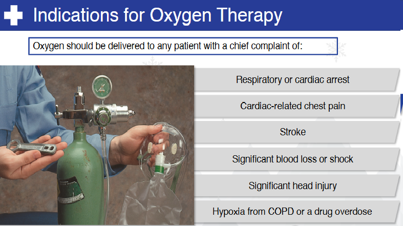   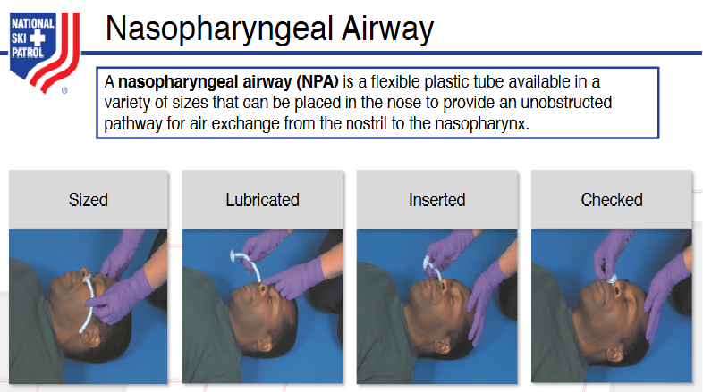   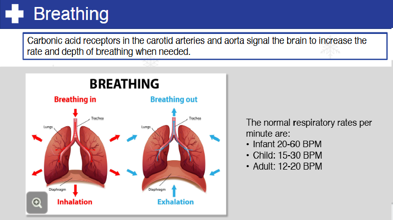      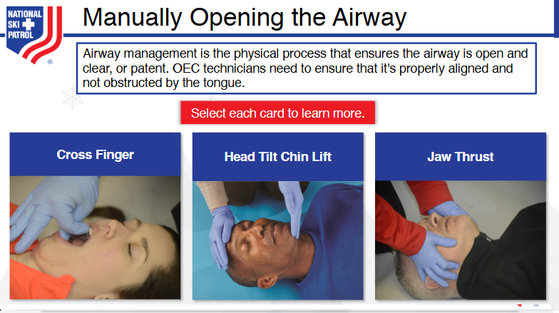   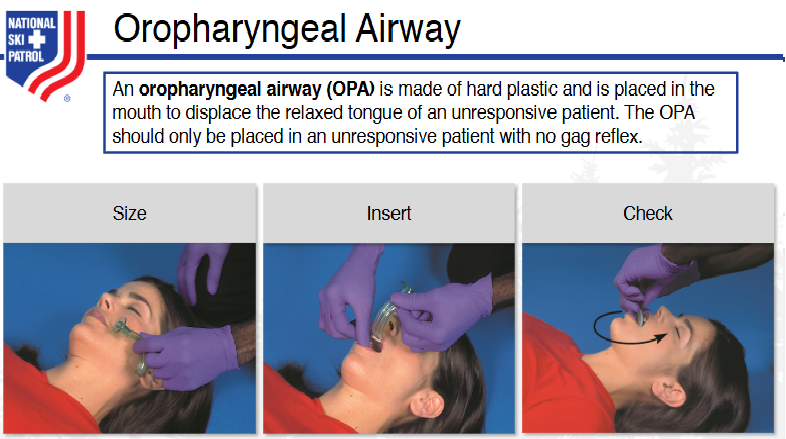   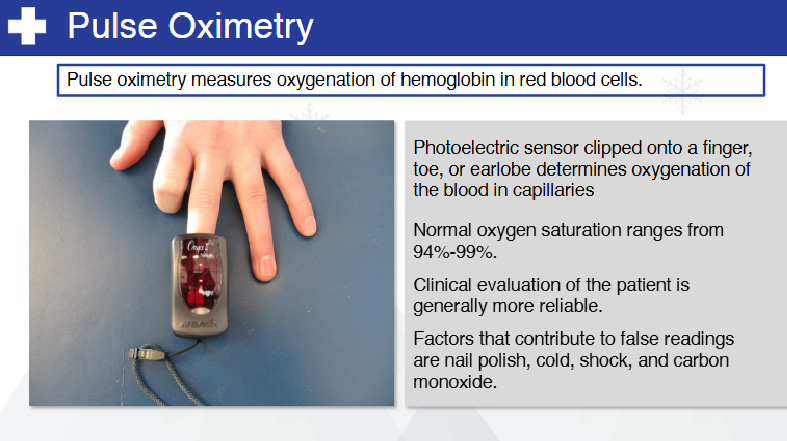   
    

## Github    https://github.com/JoeEberle/ 
## Email  josepheberle@outlook.com 

    

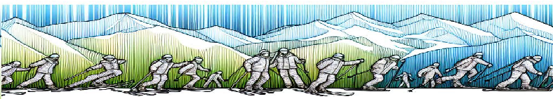
    